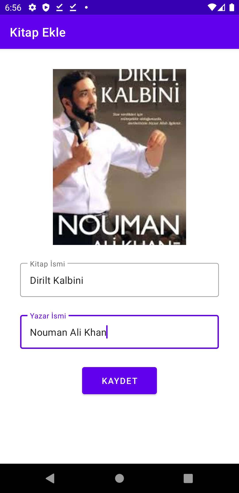

# Kitap Alıntıları RoomDatabase Java   
### **RoomDatabase** kütüphanesini öğrenebilmek için geliştirdiğim Java ile yapılmış bir uygulamadır. 
Beğendiğiniz kitap alıntılarını **RoomDatabase**'e kayıt edebileceğiniz bir uygulamadır.  

** RoomDatabase**'den ayrıca başka bir Jetpack üyesi olan Navigation kullanılmıştır.

# Özellikler 
* Kitap ekleyebilirsiniz. 
* Kitaplar ana sayfada isimlerinin sırasına göre sırayla listelenir. 
* Kitaba alıntı ekleyebilirsiniz. * Alıntınızı tek bir tuş ile kopyalayabilirsiniz. 
* Alıntılarınızı silebilirsiniz. * Kitap silebilirsiniz (**Kitap silindiğinde kitaba ait eklediğiniz alıntılarda silinir.**)  

## Uygulama Görselleri

| Splash Screen | Kitap Ekleme | Kitap Listesi|
| ------------ | ------------- | ------------|
|  | | | ------------------------
|Alıntı Ekle | Alıntı Liste | Alinti Lliste-2|
| | ||

## Uygulama Örnek Video

